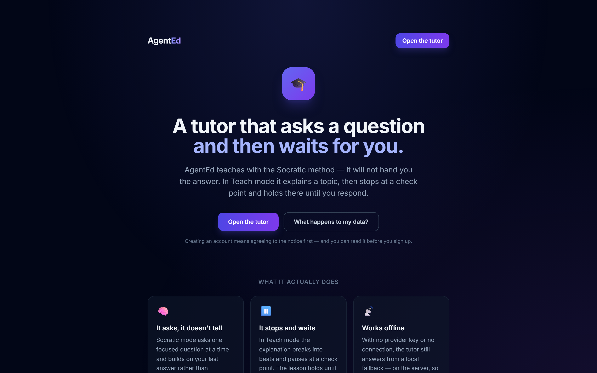
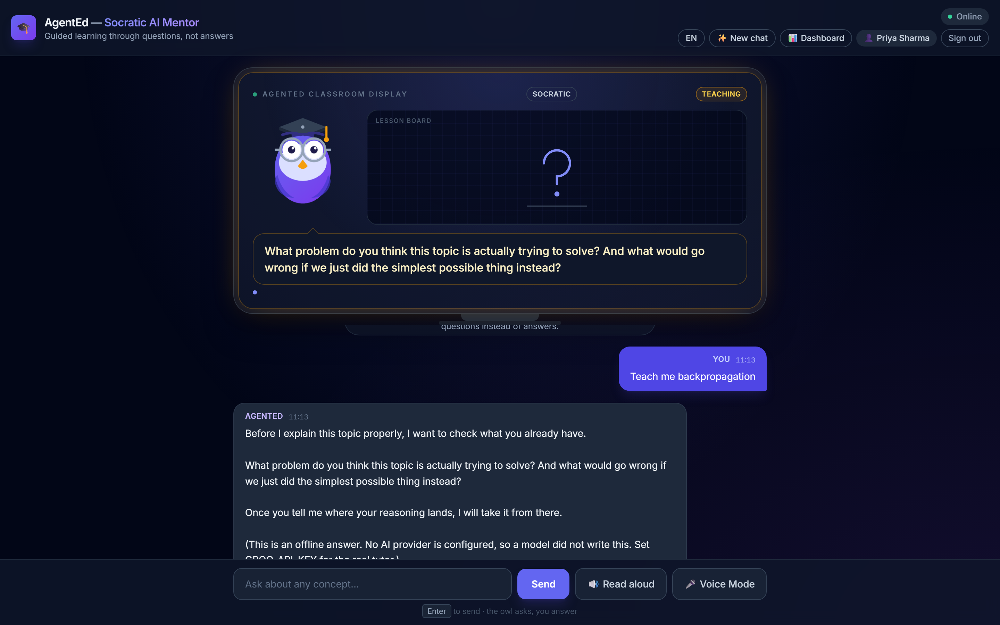
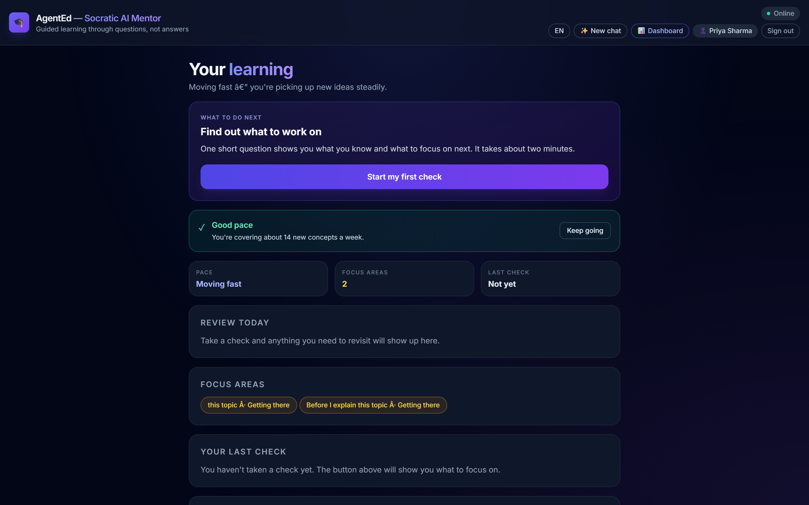
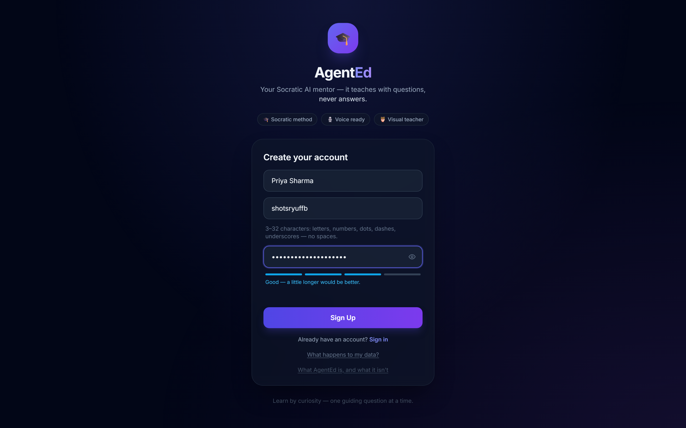
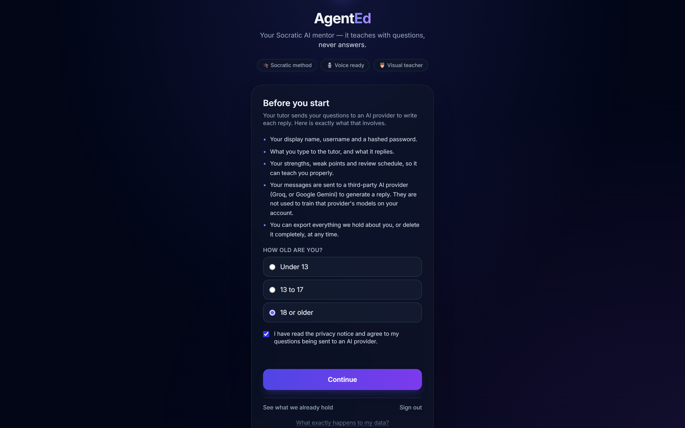
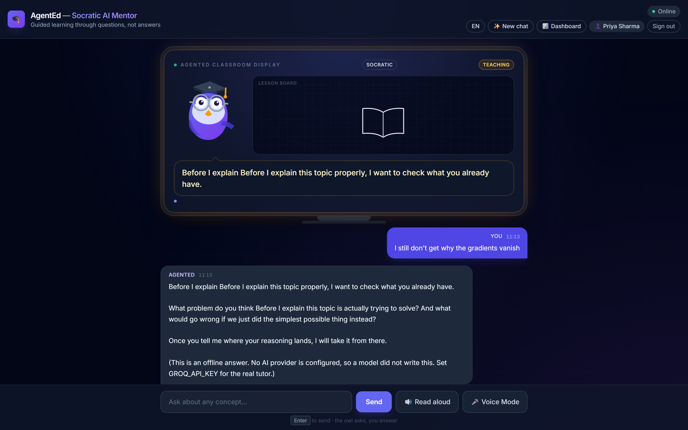
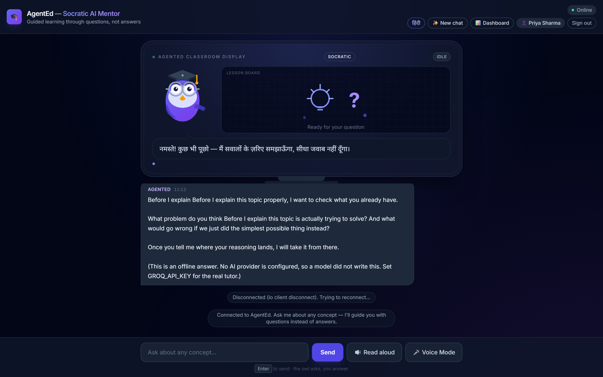

# AgentEd — an adaptive AI tutor for artificial intelligence

> A character-led tutor that teaches AI/ML, remembers what each student actually
> gets wrong, and changes how it teaches them because of it.

[](LICENSE)
[](package.json)
[](https://github.com/anandtudu078/agent-ed/actions/workflows/ci.yml)

```bash
npm ci && npm ci --prefix client        # install
cp .env.example .env                    # set MONGO_URI + JWT_SECRET (a key is optional)
npm run dev                             # terminal 1 — API on :3000
npm run dev --prefix client             # terminal 2 — app on :5173
npm test                                # 615 checks, ~50s, no key or browser needed
```

Then open **http://localhost:5173**, sign up, give consent, pick a course and press
*Start learning*. Full detail is under [Setup](#setup).

## 📸 What it looks like

Screenshots below are captured from a running instance by
`node client/scripts/capture-screenshots.mjs` — real UI, no mock-ups. The tutor
shot is in offline demo mode, and you can see the on-screen notice saying so.

**The landing page.** `/` explains the idea and gets out of the way; the tutor
lives at `/app.html`.



**An active lesson.** The owl teaches on a lesson board and asks a question
instead of giving the answer — the whole premise in one screen.



**The learning dashboard.** What to do next, pace, focus areas, and reviews
coming due, derived from what the student actually got wrong.



<details>
<summary>More screenshots — sign-up, consent, a follow-up turn, Hindi</summary>

**Sign-up.** Name, username, password. No email, no OAuth, no waiting.



**Consent.** Asked before the first AI call and again from the dashboard. Not a
dismissable banner.



**A second turn.** The tutor answers the student's actual question about the
previous one.



**Hindi.** A first-class mode, in Devanagari, including what gets read aloud.



</details>

### 🧪 No API key? Read this first

**You do not need an AI key to run or review this project.** Set one line in
`.env` and the entire app works end to end:

```bash
ALLOW_OFFLINE_AI=1
```

The tutor, the assessments and the whole progress pipeline then answer from a
deterministic local stand-in, so you can click through the real product in about
two minutes. Every reply says **on screen** that it is offline and names the key
that would switch it to the real model — so a placeholder can never be mistaken
for the real thing, in a demo or in production. The stand-in refuses to activate
under `NODE_ENV=production`, full stop.

A [Groq](https://console.groq.com) key is still the best demo if you have one:
the real tutor, the real diagrams, the real grading. But nothing above needs it.

---

## 📋 Contents

| | |
|---|---|
| [📸 What it looks like](#-what-it-looks-like) | screenshots of the real app |
| [💡 Project overview](#project-overview) | what it is and who it is for |
| [🛠️ Technologies used](#technologies-used) | stack, and the repository layout |
| [⚙️ Setup & installation](#setup) · [🚀 How to run](#how-to-run) | prerequisites, env vars, the two terminals |
| [✨ Features](#features) | course detail, notes, checkpoint tests |
| [🧪 Tests](#tests) | 931 checks, 21 suites, and the quality gate |
| [🧠 How the adaptive loop works](#the-adaptive-loop) | the core idea, end to end |
| [🏗️ Architecture](#architecture) | the code, and the seams worth reading first |
| [🔐 Session handling](#session-handling) · [🛡️ Security notes](#security-notes) | auth, cookies, CSRF, rate limits |
| [⚖️ Consent](#consent) | the minor-safety and data-rights rules |
| [🎯 Design decisions](#design-decisions) | judgement calls about a person |
| [⚠️ Known limits](#known-limits) | what is **not** proven, stated plainly |

**If you only read one thing**, read
[How the adaptive loop works](#the-adaptive-loop) — it is the difference between
this and a chatbot. If you are reviewing the work rather than the idea, go
straight to [Tests](#tests): every claim in this file is backed by a suite you can
run.

---

## 💡 Project overview

```
diagnose → teach → test → adapt → schedule review → welcome back
```

Most tutoring software generates explanations. AgentEd keeps a model of the
individual student — their weak concepts, their specific wrong ideas, what is
holding them up, and how they are behaving right now — and feeds that into the
prompt that writes the next reply. That is what the **last four steps** of the
loop are for; the first two are what any chatbot does.

Around that loop:

| Built around it | What it does |
|---|---|
| **Learning alerts** | what to do next, derived from the same state the tutor reads |
| **Course notes** | the whole syllabus as a printable PDF, built in the browser, Hindi too |
| **Checkpoint tests** | fall due as you work through a course, and can never be invented |
| **An owl** | whose face, cap and speech are a function of how the last turn went |

The tutor is **Socratic by default** — it asks rather than tells, and waits for
you to commit to an answer before explaining. A **Teach me** mode walks a lesson
beat by beat instead, with a diagram on the board for each one.

### Who it is for

A student working through AI/ML who keeps re-reading the same chapter and not
retaining it. The premise is that the reason is knowable and fixable: you are
told which of your own wrong ideas is still blocking you, rather than being
handed the same explanation again.

---

## 🛠️ Technologies used

**Backend** — Node.js 24 · TypeScript · Express 5 · MongoDB + Mongoose 8 · Socket.IO

**Frontend** — TypeScript · Vite · Tailwind (CDN) · Socket.IO client

**AI providers** — Google Gemini (tried first) · Groq (the fallback when Gemini's
quota is spent or no Gemini key is set). Both have free tiers, and the app degrades
gracefully if neither is configured — registration, the catalog, courses and the
dashboard all work without a key; only the tutor, assessments and diagrams need
one. The ladder is keys × models, and Gemini sits behind a circuit breaker so a
free tier pinned at zero does not add its retries to every reply.

> Judge's note: this ordering was stated backwards in an earlier revision of this
> file. The code in `src/services/aiService.ts` is the source of truth — Gemini is
> attempted first and Groq catches what is left.

**Auth & security** — `httpOnly` cookies · JWT access + rotating refresh tokens ·
`bcryptjs` · Helmet · CORS allowlist · `express-rate-limit` · CSRF header

**Testing** — no framework. Plain Node scripts, because the project has none and
consistency beats ceremony. Playwright drives the four browser suites; the pure
logic suites run under `ts-node` or Node 24's native type stripping.

**Why no frontend framework?** The entire client is `main.ts` plus eight
components. One cohesive event loop drives the owl, speech and the socket
together, and rendering is hand-written on purpose — `renderVisual` is the
security boundary between model output and the DOM, so it is deliberate code
rather than a template.

**Repository layout**

```
src/                  Express API
  routes/             auth · courses · dashboard · assessment · account
  services/           tutor pipeline, spaced repetition, diagrams, curriculum
  models/             Mongoose schemas
  middleware/         auth, consent, rate limiting, AI spend
  data/               the authored AI/ML curriculum
client/src/           Vite client — main.ts + 8 components/
scripts/              server-side unit suites (no browser needed)
client/scripts/       browser suites (Playwright)
.github/workflows/    CI: types + unit tests, and the four browser suites
```

---

<a id="setup"></a>

## ⚙️ Setup & installation steps

**Prerequisites**

- Node.js **24 or newer** — required, not preferred. The client test suites run
  as `node scripts/*.ts` and rely on native type stripping; on Node 20 or 22 they
  die with `ERR_UNKNOWN_FILE_EXTENSION` before a single check runs. Both
  `package.json` files declare `"engines": { "node": ">=24" }` so npm warns you
  rather than letting you discover it as a mysterious test failure.
- A MongoDB instance — local `mongod`, a container, or a free MongoDB Atlas cluster
- An AI provider key — **optional**, see [No API key? Read this
  first](#no-api-key-read-this-first). A free [Groq](https://console.groq.com)
  key is the best demo if you have one.

**1. Install**

```bash
npm ci
npm ci --prefix client
```

Use `ci` rather than `install` — it installs exactly what `package-lock.json`
pins, so you get the same tree every time instead of npm quietly resolving
something newer. Verified from an empty `node_modules`.

**2. Configure**

```bash
cp .env.example .env
```

Then edit `.env`. Two values are genuinely required:

| Variable | Required | Notes |
|---|---|---|
| `MONGO_URI` | **yes** | `mongodb://127.0.0.1:27017/agented` works with local Mongo |
| `JWT_SECRET` | **yes** | At least 16 characters. The server refuses to start without it. |
| `ALLOW_OFFLINE_AI` | no | **Set to `1` to run the whole app with no AI key.** Demo mode — see [above](#no-api-key-read-this-first). Refuses under `NODE_ENV=production`. |
| `GROQ_API_KEY` | no | Real tutor, assessments and diagrams. Without it the tutor 502s — *unless* `ALLOW_OFFLINE_AI=1`. |
| `GEMINI_API_KEY` | no | Tried first; Groq is the fallback when Gemini's quota is spent |
| `GEMINI_EXTRA_KEYS` | no | Comma-separated extra Gemini keys, rotated when the primary is exhausted |
| `CLIENT_ORIGIN` | no | Already defaults to the dev client at `localhost:5173` |
| `AI_DAILY_CALL_LIMIT` | no | Per-student daily AI budget. Defaults to 250 |
| `PORT` | no | Defaults to 3000 |

The AI keys are marked optional because `ALLOW_OFFLINE_AI=1` genuinely replaces
them. Without either, registration, the catalog, courses and the dashboard all
still work — only the tutor and assessments need one.

`.env` is loaded automatically by `dotenv` — no extra flags needed.

---

<a id="how-to-run"></a>

## 🚀 How to run the project

**3. Run the server and the client in two terminals**

```bash
npm run dev                  # API on http://localhost:3000
npm run dev --prefix client   # app on http://localhost:5173
```

Open **http://localhost:5173** for the landing page; the tutor is at
**http://localhost:5173/app.html**.

The catalog seeds itself on first dashboard load — no migration step.

Then: sign up → give consent → pick a course → open its detail → *Start
learning*. The tutor greets you with a question.

The subsections below walk through what you should see. Everything after them is
design rationale and test evidence.

---

## ✨ Features

### Picking a course

Clicking **Details** on any course card opens the full syllabus: every module,
and the subtopics each one covers, so a student can see what a lesson is about
before deciding to start it rather than finding out halfway through. The dialog
carries the student's real progress — completed modules ticked, the next one
marked — and its button says what it will actually do: *Start learning*,
*Continue with "Variables and types"*, or *Review this course* once everything is
done.

Starting from there enrols the student and opens a Socratic chat aimed at the
right module. The existing card buttons are unchanged, so this is an addition
rather than a replacement.

Subtopics are authored per module in `src/data/curriculum.ts`. They are
*descriptive and, since each one is also a learning entry point, clickable*: click
any subtopic in the dialog and the tutor opens a Socratic chat scoped to exactly
that part rather than to the whole module. The request is matched fuzzily against
the syllabus (`client/src/components/subtopics.ts`) because a student types "backprop"
where the course says "Backpropagation and gradient flow" — and the match refuses
to fire on a word that would match half the catalog.

Progress is still counted per module, so adding or removing a subtopic can never
move a student's percentage.

### Downloadable notes

The course dialog also has **Download notes (PDF)**, which lays the whole syllabus
out as a printable A4 document: every module, its subtopics, which ones are done,
and a summary. Built entirely in the browser from the payload the dialog already
rendered from, so it costs no round trip and cannot drift from what the student
was shown. Hindi notes are translated; the module titles stay as the syllabus
words them, since the tutor will never say a transliterated version of them.

It opens the browser's print dialog with **Save as PDF** as the destination, in a
clean document that carries none of the dashboard's dark chrome — `@page` margins,
`break-inside: avoid` so a module never splits across a page, and
`print-color-adjust` so the status pills print as pills rather than white boxes.
No PDF library is involved. Every one of them draws its own text, which means
embedding and subsetting a font, and none of the small ones carry Devanagari;
handing the page to the browser gets correct Hindi shaping and correct page
breaks from the engine already rendering the dashboard, for the price of one
same-origin iframe (`client/src/components/notes.ts`).

### Checkpoint tests

A student halfway through a twelve-module course could take a test on whatever they
felt like, or take six tests on the same first module. Neither number meant
anything, because nothing tied a test to *where they were in the course*.

A **checkpoint** is the honest middle: test what has accumulated since you last
did. Every three completed modules, a test comes round; courses under four modules
get a single test at the end rather than meaningless intervals. The schedule is
derived on read from the live syllabus and the last recorded test, so it can never
go stale or claim a test is due on a module the student has not reached. What is
stored is the test event — which modules it covered — not a schedule.

The server decides what to ask and refuses when nothing is due, so a test can
never be invented for a result that could not be attributed to anything. The
coverage is signed into the attempt ticket rather than sent back by the client, and
an ordinary topic test records no checkpoint at all — otherwise a student could
clear a whole course's checkpoints by taking unrelated tests.

**No AI key?** Registration, sign-in, the course catalog, the course detail view
and the dashboard all work. Only the tutor, assessments and diagrams need one.

---

## 🧪 Tests

**931 checks across twenty-one suites**, all of which run in CI or from one command.

| | Suites | Checks | Needs |
|---|---|---|---|
| Pure logic (`npm test`) | 17 | 615 | nothing — no DB, no key, no browser |
| Browser (Playwright) | 5 | 285 | the app running + MongoDB |
| Tutor quality (`test:quality`) | 1 | 50 + judged | a live AI key |
| **Total** | **23** | **950** | |

Start here:

```bash
npm test              # runs every suite that needs no browser (16 suites, ~50s)
```

Or individually:

| Command | Checks | What it covers |
|---|---|---|
| `npm run test:parse` | 36 | `parseVisualSpec` — rejects hostile model output |
| `npm run test:review` | 38 | Spaced-repetition scheduling |
| `npm run test:profile` | 30 | The learner profile and its prompt rendering |
| `npm run test:difficulty` | 32 | Adaptive difficulty bands, including topic matching across spellings |
| `npm run test:prereqs` | 17 | The prerequisite graph |
| `npm run test:flow` | 18 | Flow signals |
| `npm run test:reaction` | 36 | How the owl reacts to a student's turn |
| `npm run test:checkpoints` | 46 | Course checkpoint intervals and coverage |
| `npm run test:return` | 32 | Return detection and first run |
| `npm run test:course` | 26 | Course progress derivation, including malformed stored topics |
| `npm run test:offline` | 128 | The offline AI gate (incl. the tutor stand-in), the auth cookie policy, and the consent rules |
| `npm run test:quality` | 50 + judged | Whether the tutor actually teaches — **needs a live AI key** |
| `npm run test:beats` | 24 | Lesson-beat segmentation |
| `npm run test:notes` | 36 | Downloadable course notes (printable PDF) |
| `npm run test:alerts` | 40 | Learning alerts and subtopic matching |
| `npm run test:encoding` | 6 | No mis-decoded punctuation in tracked source |
| `npm run test:sketches` | 50 | Beat-sketch matching and SVG rendering |
| `npm run test:render` | 29 | Diagram renderers (from `client/`) |
| `npm run test:ui` | 102 | Full browser flows, consent step, no readable tokens (Playwright) |
| `npm run test:workflow` | 55 | The first-run journey: landing → sign-up → consent → course detail → lesson |
| `npm run test:playback` | 31 | Beat sequencing, turn-taking and sketch/board pairing (Playwright) |
| `npm run test:security` | 94 | Auth, authz, CORS, CSRF, cookies, consent enforcement, XSS |
| `npm run test:login` | 15 | The login page: render, validation, wrong password, register toggle (Playwright) |
| `npm run test:journey` | 46 | **A real student, start to finish, against live providers** — see below |

`npm run test:browsers` runs every browser suite in the order CI uses.

**`test:journey` is the one to run before a demo.** Every other browser suite
drives a single component or stubs the model; this is the only one that answers
the question a user actually cares about — if a real person signs up and tries to
learn something, does the whole thing work end to end? It needs a live key and an
empty database (it exercises first-run, catalog seeding and the first-run
greeting), so it is a deliberate manual gate rather than a CI step.

The browser suites need the app running (`npm run dev` in both terminals) and a
reachable MongoDB. Five of the six need no AI key:

```bash
npm run test:browsers   # all five, in CI's order

# or individually, in this order:
npm run test:login      # first: cheap, and warms nothing
npm run test:security   # next: it can burn the auth rate-limit budget
npm run test:ui
npm run test:workflow
npm run test:playback
```

`test:journey` is the exception and is deliberately not in that list — see above.

`test:security` is listed first on purpose. It can optionally exhaust the auth
rate limiter, which would then block the registration the UI suite depends on.

Type-check both projects:

```bash
npx tsc --noEmit              # server
npx tsc --noEmit --project client/tsconfig.json
```

> The `parse` and `render` suites are the security boundary for everything the
> owl draws. They had no permanent coverage before — the earlier tests were a
> throwaway script that was later deleted.

### Does the tutor actually teach?

Every other suite tests the app *around* the model - parsing, scheduling,
segmentation, rendering, authorisation. `test:quality` asks the question none of
them ask: is the teaching any good?

```bash
npm run test:quality     # needs GROQ_API_KEY or GEMINI_API_KEY
```

It calls the real `generateTutorResponse` with the real system prompts across
eight cases - Socratic and Teach, English and Hindi, including a follow-up that
has thread context and a student who demands the answer outright - and grades
what comes back in two separate layers:

**Contract checks (50) - deterministic, and they gate.** The promises the
prompts make and the code depends on: Socratic mode must not hand over the
answer, must ask something, must stay short enough to think about; Teach mode
must explain substantively and close by checking understanding; Hindi must come
back as Devanagari. A prompt is a request. These make some of them obligations.

**Judged checks - one model call per case, reported but never gating.** Factual
soundness, whether the withholding actually worked, whether it built on the
thread, whether a beginner would understand it. These are a grader that is
itself a language model, so failing a run on its opinion would produce a flaky
suite nobody trusts. The scores are a baseline to watch for drift.

Dimensions are only scored where they apply. `withholds` is not counted on a
Teach-mode case, where explaining *is* the job, and `buildsOnThread` is not
counted when the case has no prior turn. A baseline that punishes correct
behaviour is worse than no baseline.

Last run:

```
CONTRACT   50/50 passed
JUDGED     withholds        5/5  (100%)
           factuallySound   8/8  (100%)
           onTopic          6/8  ( 75%)
           helpsABeginner   7/8  ( 88%)
           buildsOnThread   1/1  (100%)
```

Not in CI: it spends real provider quota and takes a few minutes. It is a manual
gate before a release, not on every push. `QUALITY_SHOW_REPLIES=1` prints every
reply for reading.

> The honest limit: this measures whether the tutor *behaves* as specified. It
> cannot prove the explanations are pedagogically good, and the judge shares a
> blind spot with the model it is grading. It is a floor, not a ceiling.

### Continuous integration

`.github/workflows/ci.yml` runs on every push and pull request to `master`, in
two jobs:

- **Types and unit tests** — both `tsc` projects plus the ten no-browser suites.
  No services and no API keys, so a regression fails in under a minute.
- **Browser suites** — a MongoDB service container, the built API on `:3000`,
  Vite on `:5173`, and Playwright Chromium. Runs security, then UI, then
  beat playback, and uploads failure screenshots as an artifact.

The split is not a convenience. All four bugs fixed in the beat-and-sketch work
passed review and passed every unit suite, and failed only in a browser — a
sticky mood left behind by beat playback, a language switch that appeared to do
nothing, a reaction talked over by a stale explanation. None were reachable from
a pure logic test, which is the reason the slow job exists at all.

CI uses no AI provider keys. The browser suites are made possible by a
deterministic stand-in for the assessment endpoints
(`src/services/offlineAi.ts`), which answers on the **server** rather than in the
browser — so the whole pipeline runs for real: question → grade → `Progress` and
`Session` writes → dashboard render. A browser-side stub would have painted a
result panel while writing none of that, forcing the review-card and weak-point
checks to be skipped.

The stand-in is gated behind `ALLOW_OFFLINE_AI=1` and **refuses outright when
`NODE_ENV=production`**. That guard is the entire safety story: a deploy with a
missing key would otherwise show real students a fabricated score and invented
feedback, which is strictly worse than the honest `502` the routes return today.
`npm run test:offline` exists mostly to attack that guard.

Its score is deliberately set below `REVIEW_PASS_SCORE`, so an offline run still
records a weak point and a due review card. A higher score would take the happy
path through a pipeline that would otherwise never execute in CI.

### The owl takes turns

Beats made the tutor's delivery readable. They did not make it a *lesson*: a
lesson that asks a question and then talks straight past it is still a monologue,
and a monologue is the defining shape of a chatbot — user asks, system emits a
block of prose, user watches.

So in **Teach mode** the playback loop now stops at each check-for-understanding
beat and waits. The owl goes expectant, the status pill returns to `Idle` (it is
not thinking or teaching, it is waiting), and a pulsing cue appears under the
bubble: *"Your turn — answer to continue"*, in Hindi as well. The lesson
continues only after the student replies. In **Socratic mode** nothing pauses,
because a Socratic reply is already a single question the student answers.

Three things can end a wait: an answer, an interruption, or four minutes. The
timeout is not optional — a student who closes the tab must not leave a pending
promise, and one who does not know what to say should get the rest of the
explanation rather than a frozen owl.

Answering *cancels* the remaining beats rather than resuming them, so the answer
drives a fresh tutor reply. A response generated from what the student actually
said beats a recording played back regardless — but it does mean the beats after
a mid-lesson question are never heard. That trade is documented under
[Known limits](#known-limits) rather than left to be discovered.

This also fixed a real bug: **New Chat did not stop the owl.** Bumping
`conversationEpoch` invalidates incoming replies, but a beat playthrough is
driven entirely on the client, so clearing the thread under a running lesson left
it talking — or, once turn-taking landed, waiting for an answer to a question
that had just been deleted from the screen.

### The owl reacts to the student

The owl's face is not decoration. It is a function of how the student's turn
actually went (`src/services/tutorReaction.ts`), computed server-side so the rule
is testable without a DOM and so the socket and the HTTP route cannot disagree.
Previously the server sent the student's `masteryEstimate` inside a JSON string the
client never parsed, so the only thing that ever moved the mascot's face was a
graded test score — a student could have three turns go badly and the owl looked
identical to one who had just had a breakthrough.

Three decisions are load-bearing:

- **A strong turn with open misconceptions gets `happy`, never `excited`.** A high
  score with an unaddressed wrong idea is not a success, and an owl that
  congratulates it teaches the student to trust a reaction that isn't earned.
- **A question never reads as excitement.** When the tutor replies with a question
  it is engaging the student's idea, not grading it — worth warmth, but not evidence
  of understanding either way.
- **Missing or malformed input returns `neutral`, never enthusiasm.** The estimate
  comes from a model; if it is absent, `NaN`, or non-finite, the owl goes quiet.
  Inventing a mood is worse than no mood. (A *finite* out-of-range value like 500 is
  a model scoring on the wrong scale, and is clamped.)

The vocabulary the tutor may use is deliberately narrower than the mascot's own
(`proud` and `curious` are set locally): what the tutor reports is a judgement about
the *student*, and letting a remote payload drive `proud` would let a garbled reply
make the owl congratulate someone for nothing.

## 🔔 Alerts

The dashboard had the raw material for every alert — due reviews, weak points,
progress, pace — and showed it as *evidence*: counts, percentages, lists. What was
missing was the *conclusion*. An alert states what is true and carries the button
that does something about it (`client/src/components/alerts.ts`), routed into flows
that already existed. An alert with no action is a notification, and notifications
get muted.

The rules that matter are all about not lying to a student:

- **Course completion is judged against the live syllabus**, never the stored count.
  A renamed module leaves a stale title in `completedModules` forever, so comparing
  set sizes would report a half-finished course as done.
- **Only the most recent test result** feeds the "poor score" alert. Walking
  backwards through history would re-nag about a topic the student has since gone
  on to ace — the most demoralising thing this component could do.
- **One gap raises one alert.** A weak point and a poor score describing the same
  topic reads as nagging.
- **Absence never displaces something actionable.** Telling someone with three
  reviews due that you missed them is simply the wrong priority order.
- **A student with nothing due still gets exactly one alert**, pointing somewhere to
  go, rather than an empty panel that reads as "nothing to do here".

Alerts are derived on read and capped at three. A page of eleven alerts is a page
nobody reads, and the weakest one is what trains people to dismiss the rest.

---

<a id="the-adaptive-loop"></a>

## 🧠 How the adaptive loop works

**A student asks about transformers.** The tutor receives the transcript, the
topic, their language, and a briefing built from what we know:

> *What you already know about this student:*
> *- Shaky so far: backpropagation*
> *- Solid on: matrix multiplication. Do not re-explain from scratch.*
> *- They have repeatedly shown this wrong thinking: thinks backprop is the same
> as gradient descent*
> *- They are struggling across several topics. Slow down, use a concrete
> example before any formula.*

**They get tested.** The question's difficulty comes from their strength *and*
review history, so a struggling student gets a single concrete step rather than
a two-part abstraction.

**Topics are matched loosely, but only just loosely.** The client says
"Backpropagation", the syllabus says "backpropagation", the assessment records
"backprop". Comparing those exactly meant a student who had genuinely failed this
topic was recorded as never having been seen failing it, and got a standard
question instead of a smaller one — a failure that hid the problem rather than
showing it. Matching now normalizes punctuation and filler words, accepts one
name being contained in a fuller one, and falls back to a shared identifying
word.

That last step is where it could have caused harm, so it is fenced in: *attention*
and *attribution* share a prefix and nothing else, and are still different topics,
because being handed remedial work on the wrong concept is worse than being handed
a question that is slightly too hard. Where several records match, the **weakest**
one decides — one lucky strong result cannot mask an earlier failure on the same
concept. `test:difficulty` pins all of this, in both directions.

**They answer.** Three things are stored: the score, the *specific wrong idea*
the answer revealed, and when. Strength blends with what was already known
rather than replacing it. A review is scheduled — further out if it landed,
tomorrow if it didn't.

**They come back tomorrow.** The dashboard says *"Start with matrix
multiplication"*, not *"work on transformers"*, because the graph says
transformers sits on top of it.

**They ask the same thing a fourth time.** Within 45 minutes, substantively the
same question, the tutor is told to change approach — and explicitly *not* to
mention the repetition.

---

## 🏗️ Architecture

```
src/
  server.ts                    API + socket
  data/curriculum.ts           28 courses / 186 modules (3 subtopics each),
                               across 9 AI branches + a maths & CS spine
  services/
    aiService.ts               tutor prompt; takes the learner briefing
    progressService.ts         learner profile, difficulty, prerequisites
    flowSignals.ts             repetition and pacing
    tutorReaction.ts           how the owl reacts to a student's turn
    checkpoints.ts             course checkpoint intervals
    returnState.ts             "welcome back"
    visualService.ts           validates model output into a diagram spec
    consent.ts                 the consent rules, as pure functions
    assessmentService.ts       question generation and grading
    courseService.ts           prerequisite graph, progress derivation
    offlineAi.ts               the deterministic stand-in used by CI
  models/                      User, Session, Progress, Course, tokens, usage
  middleware/                  auth, consent, rate limits, AI spend cap
  routes/                      auth, courses, dashboard, assessment, account

client/src/
  main.ts                      chat, speech, return path, first run
  components/mascot.ts         the owl - six moods, real reactions
  components/diagrams.ts       hand-written SVG, every string escaped
  components/dashboard.ts      alerts, checkpoints, reviews, course detail
  components/alerts.ts         what the student should know right now
  components/subtopics.ts      fuzzy match from a request to a subtopic
  components/notes.ts          course notes as a printable PDF
  components/beats.ts          splits a reply into playable lesson beats
  components/sketches.ts       16 hand-drawn SVGs matched to a beat

scripts/                       server-side suites (no browser needed)
client/scripts/                browser suites (Playwright)
```

**One turn, end to end.** Every arrow is a real function; nothing here is
illustrative.

```
  student types
      │
      ▼
  socket "chat" ──► requireAuth ──► requireConsent ──► aiSpendLimit
      │                              (a minor needs       (daily budget,
      │                               guardian consent)    charged on the
      ▼                                                    socket too)
  progressService ──────────► learner profile
  (weak points, mastery,          │
   prerequisite graph)            │
      │                           ▼
  flowSignals ────────────► flowGuidance
  (repetition, pacing)             │
      │                           │
      └──────────┬────────────────┘
                 ▼
      generateTutorResponse(mode, language,
          learnerBriefing, flowGuidance, history, query)
                 │
                 ├─► Gemini (keys × models, behind a breaker)
                 └─► Groq   (fallback)
                 │
                 ▼
  tutorReaction(turn)  ──► owl mood      visualService ──► diagram spec
  (server-side, testable)                    │
                                             ▼
                              parseVisualSpec ──► hand-written SVG
                              (bounds + escapes; never raw model markup)
                 │
                 ▼
  store: score, the specific wrong idea, when ──► scheduleReview()
                 │
                 ▼
  dashboard: alerts · due reviews · due checkpoints · return state
```

**The seams worth reading first.** `generateTutorResponse` in
`src/services/aiService.ts` — its `learnerBriefing` parameter is what turns this
from a textbook with a dashboard into a tutor; before it existed, none of the
collected telemetry reached the model at all.

`tutorReaction` and `checkpoints` are the other two, and they share a shape: both
are pure functions over data the server already holds, both decide something a
student acts on, and both are the kind of rule that is easy to get subtly wrong and
impossible to notice. Keeping them out of the routes is what let them get a suite
instead of a paragraph.

---

## 🔐 Session handling

Tokens are **httpOnly cookies**, not `localStorage`. A token in `localStorage` is
readable by any script on the page, so one injected `<script>` exfiltrates a
student's session with no user interaction and nothing visible to notice. An
httpOnly cookie cannot be read by JavaScript at all.

Moving the credential into a cookie is only half the change — cookies are
attached to cross-site requests automatically, which is the problem `localStorage`
never had. Two defences, deliberately redundant:

- **`SameSite=Lax`** on both cookies. Blocks the cross-site POST that CSRF
  actually needs. `strict` would be stronger and would also break a student
  arriving from a shared lesson link, so `lax` is the trade.
- **An `X-Requested-With` check** on every non-GET API request
  (`requireCsrfHeader`). A cross-origin caller cannot set a custom header without
  a CORS preflight, and this server refuses preflights from unlisted origins.

`Secure` is set in production and deliberately **not** in development: a `Secure`
cookie over `http://localhost` silently vanishes, and the only symptom is "login
is broken". `npm run test:offline` asserts both directions, including that
`NODE_ENV=Production` (capitalised, as some hosts set it) still marks cookies
secure — the same case-sensitivity trap that once left the offline AI gate open in
production.

Two things the migration could not keep, and did not try to:

- **`GET /api/auth/me`** now exists, because "am I signed in?" can no longer be
  answered from local storage — a cached display name is not a session. The boot
  path paints from the cache and confirms against the API, so an expired session
  lands on the auth screen instead of a shell full of 401s.
- **Sign-out awaits the server** before showing the auth screen. Fire-and-forget
  looked fine while the token lived in local storage, where removing it was
  synchronous; with a cookie, the UI could claim to be signed out while the
  credential was still live and a reload would sign the student straight back in.

---

<a id="consent"></a>

## ⚖️ Consent, and who it protects

This app is aimed at students — the people least able to consent meaningfully to
their data going to a third party. Every tutor prompt carries a student's own
words, their mistakes and their progress, out to Groq or Gemini. So the flow is
built around one decision, and everything else serves it:

> **May this student send a question to an AI provider?**

**Where the rule lives.** `src/services/consent.ts`, as pure functions. Not in a
route, not in the form. A rule like "a minor without guardian consent must be
refused" is worth far more with 60 unit tests than a paragraph in a README — and
consent logic has a habit of being duplicated in the form, the API and the client,
where they drift and the copy that matters is the one nobody tests.

**What counts as consent.** Recorded per account: who agreed, which version of the
notice, and when. Deliberately conservative:

- Silence is never consent. A new account cannot use the AI features.
- **Stale consent is not consent.** Bump `CONSENT_POLICY_VERSION` and every
  existing consent goes back to being asked for. That is the entire reason the
  version is stored.
- **Under 18 always needs an adult**, whatever the student ticks. The guardian's
  name is recorded — a blank or one-character name is refused, and a whitespace-only
  name is refused too, since `"   "` is truthy and a naive `if (by)` accepts it.
- A database error is never read as "your account is gone". `requireAuth` fails
  the *request* and keeps the session.

**Enforced on the server, on the only path that reaches a provider.** The socket
chat handler and both assessment routes. Client-side gating is not a control — the
client is the thing an attacker controls — so the server re-reads the record on
every AI call rather than trusting the token, which is good for 30 minutes.

**Withdrawal bites immediately**, for the same reason. A consent that takes half
an hour to revoke is not withdrawal.

**What a refusal does *not* do.** Sign-in, the course catalog, the dashboard, and
exporting your own data all work without consent. Only calls that leave the
machine are gated. Refusing a minor their own account would be a worse outcome
than not teaching them.

**Data rights, because a notice that promises them is worth nothing:**

- `GET /api/account/export` — everything held, as JSON. Works whether or not
  consent was given; the right to see your data cannot depend on agreeing to
  anything. The password hash is included on purpose: it is one-way, and omitting
  it from your own export looks like concealment.
- `DELETE /api/account` — erases the account, conversation, progress and tokens.
  Scoped by the authenticated id, never a username from the request body.
- `DELETE /api/auth/consent` — withdraws consent and keeps the progress, so
  changing your mind about the notice is not punished by losing your work.

**One bug this found, which is why it is worth reading.** Erasure did not revoke
the session: `requireAuth` trusted the JWT, which stays valid for 30 minutes, so a
deleted account kept working until it expired. It now confirms the account still
exists on every authenticated request — one indexed `_id` read, which is the price
of deletion actually working.

The trade, stated plainly: **the guardian's name is self-reported**, because
verifying it would mean emailing an adult and there is no mail infrastructure
here. That is how school-registered accounts are usually set up, but it is not
verification, and the app should not pretend otherwise.
A bearer header is still accepted as a fallback, which is what lets the security
suite and any scripted client authenticate without a cookie jar. The browser path
never uses it.

<a id="design-decisions"></a>

## 🎯 Design decisions about the student

These are judgement calls about a person, not facts about a model. They are the
most likely things to need changing.

- **Remedial work is never labelled.** Nothing tells the student the difficulty
  changed, and the prompt forbids mentioning it. A student handed easier work
  should believe it was a normal question.
- **Repetition is never pointed out.** The tutor is told to change approach, not
  to say *"you've asked this three times"*.
- **No emotion detection.** Frustration isn't observable from message text. A
  test asserts the guidance never names a feeling.
- **Silence is not "you're doing great".** A student with no data gets no
  briefing at all, rather than an empty one that reads as an absence of gaps.
- **"Struggling" needs two data points.** One bad test is a bad test.
- **The prerequisite graph is sparse on purpose.** A wrong edge sends a student
  backwards for no reason; an uncurated edge is cheaper than a wrong one.
- **Everything time-dependent is derived on read.** A stored `isDue` flag goes
  stale the instant midnight passes.

---

## 🛡️ Security notes

- Model output is never trusted. `parseVisualSpec` bounds and type-checks every
  field and returns `null` on any problem; the renderers escape all text and
  emit only hand-written SVG. Raw SVG from a model is never rendered — that
  would be an XSS hole.
- Rate limits are keyed on the signed-in **user**, not IP, because a school
  puts a whole classroom behind one address.
- Refresh tokens rotate on use and are stored only as a SHA-256 hash. Replaying
  a spent token revokes the whole family.
- A daily AI spend cap per student, which fails open so a database blip can't
  take the app down. It is charged on **both** entry points — `POST /api/chat` and
  the socket — because the client uses the socket, and capping only the route left
  the bill unbounded in practice.

---

## ⚠️ Known limits

### Fixed during review, recorded because they say something

Three defects found by reading rather than running the app. The first is worth
keeping in the README permanently, because of *how* it survived.

- **A checkpoint test that could never be cleared.** `checkpointStatus` capped
  `untestedModules` at four. That list looked like a display convenience, but it
  is what `/api/assessment/checkpoint` signs into the attempt ticket as
  `modulesCovered`, and `/submit` records exactly that as tested coverage. So on
  any course longer than four modules, taking the test marked four titles covered
  and left the rest untested permanently — `untested.length` never fell back
  below the interval, so the checkpoint re-armed the moment the student finished
  it, with no state they could change. Every course in the catalog is longer than
  four modules (28 of 28, longest 9), so it was reachable by anyone who finished
  a course without testing midway.

  It survived because the test suite *asserted the bug*: "the untested list is
  capped" pinned the truncation in place. That check has been replaced with six
  covering the actual invariant. A test that locks in the wrong behaviour is
  worse than no test — it converts a bug into a specification.

  The lesson generalises: **a value that crosses a trust boundary is not a
  display concern.** The moment a list is signed, stored, or asserted on, it
  stops being a formatting decision.
- **Misconception targeting was inert.** Both assessment routes matched stored
  topics to the topic being asked about with `===`. Stored topics are written by
  a grader reading free text ("backprop"), while the asked-about topic is often
  the authored curriculum string — so across the 186 authored topics, "backprop"
  and "what is a transformer" matched **zero** times. The question generator
  usually received an empty misconception list, so the documented behaviour
  ("asks about the gap rather than re-asking what went wrong before") mostly did
  not happen. Both now use the fuzzy `topicsMatch` that already existed in
  `courseService.ts` for exactly this reason.

  The matcher was there the whole time. Two call sites simply never used it.
- **Refresh rotation had a check-then-act race.** `rotateRefreshToken` read the
  record, checked `replacedByHash`, then saved. Two requests with the same token
  could both read it as unrotated and both mint a successor — one stolen token,
  two live sessions, reuse never detected, which defeats the point of rotation
  entirely. The claim is now one conditional `findOneAndUpdate` filtered on
  `replacedByHash: null`, so exactly one request can win and the loser is
  correctly read as reuse.

### Still true

- **The tutor needs a key to be genuinely good.** With `ALLOW_OFFLINE_AI=1` the
  app is fully clickable and every part of the pipeline runs for real — but the
  tutor's *reasoning* is a deterministic template, not a model. It asks a
  Socratic question and it teaches a lesson, so the modes, the beats, the owl
  and the boards all behave correctly; what you cannot judge offline is whether
  the teaching is any good. That is the one judgement this repo cannot substitute
  for a key.
- **The tutor can still recite.** The prompt asks it to name misconceptions
  directly; nothing enforces it. Verified the reply *changes*, not that it
  always says the right thing.
- **No true lip-sync.** The beak flaps on a timer — `SpeechSynthesis` gives no
  reliable boundary events. Word-accurate would mean abandoning it for
  prerecorded audio, which would cost Hindi support. What the owl does instead is
  *segment* a reply into short beats (`client/src/components/beats.ts`) and play
  them in sequence with a gap between each, so the delivery has rhythm even
  though the mouth shapes do not match the phonemes.
- **Beat segmentation is prose, not structure.** Beats are cut on sentence and
  clause boundaries with a word cap, so a reply the tutor wrote as a numbered
  list is split sensibly only because the lines happen to break. A single
  40-word sentence with no clause punctuation is broken at the least-bad comma,
  and no beat is ever re-ordered to match the diagram.
- **A wait is not the same as a reply.** In Teach mode the lesson stops at each
  check-for-understanding beat and waits up to four minutes for an answer. But
  answering *cancels* the rest of that lesson rather than resuming it — the
  answer drives a fresh tutor reply instead, which is usually what you want but
  does mean the beats after a mid-lesson question are never heard. Making the
  wait conditional on what the student actually said needs the tutor to be
  re-entered mid-lesson, which it is not.
- **Beat sketches are a keyword table, not a picture model.** Sixteen hand-drawn
  SVGs are picked by matching nouns in the beat (`client/src/components/sketches.ts`).
  A beat naming two concrete things gets whichever the cue table lists first, so
  "teach a child to recognise a cat" shows the cat — the thing being
  recognised — rather than the child. A beat naming nothing concrete gets no
  picture at all, and the board falls back to the topic diagram.
- **Memory is 12 messages.** Enough for a thread, thin for a session.
- **Prerequisite coverage is 70 of 186 modules.** Maths and deep learning are
  solid; NLP, vision, speech and robotics are largely uncurated.
- **No teacher view.** Needed before real deployment in a school. The consent
  flow is done; a teacher cannot yet see a cohort's progress.
- Gemini's free tier is exhausted on the development account, so Groq has been
  carrying everything. Both paths work; only the fallback has been exercised
  recently.

### Added late, and not yet proven the way the rest is

- **Hindi speech is verified by code, not by ear.** The owl now resolves and assigns
  an actual `SpeechSynthesisVoice` instead of hardcoding `en-US`, and the recogniser
  follows the teaching language. That fix was real — the old code confirmed a Hindi
  voice existed and then spoke through an English one — but no suite exercises it,
  because this environment has no voices and the browser suites stub `getVoices()`
  with a single fake English entry. **Check it on a real device.** On Windows,
  Hindi text-to-speech is an optional feature: Settings → Time & language → Language
  → Hindi → Language options → Speech.
- **A checkpoint is interval-by-module-count, not by time.** A test comes round every
  three completed modules. A calendar interval ("every two weeks") is a different
  feature needing a stored schedule, which would break this codebase's rule that
  everything time-dependent is derived on read.
- **The concurrency fixes are reasoned, not load-tested.** Enrollment is now one
  atomic conditional update and the progress array folds retry on a guard
  (`updateProgressWithRetry`). Both are sound in theory and typecheck, but have not
  been exercised against a running MongoDB under real contention.

